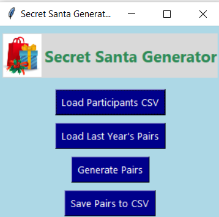

#  SecretSanta   
 **About Secret Santa**
This is a user-friendly desktop application that lets you generate employee and child pairs while avoiding duplicates. 

 **Requirements**

The application uses two input files: 

  a. Current year employee list given as a.csv file  
  b. Previous year employee and child list given as a.csv file 
  ** Please ensure that both the files are in .csv formats 

The application also uses two image files: 

  a. Label_img – An image used in the application heading.  
  b. Secret_santa icon – This is an application logo.  
  ** Please ensure that the image is in the same folder as the application 
  
 **Features**

1. Randomized assignment - Each employee is randomly paired with another employee.
   
2. Self-assignments are avoided.

3. Last year's pairings are compared to avoid same assignments in the current year.

4. Appropriate error handling has been done so users are notified why the application has failed.

 **File Formats**

**Input file** – Emp_Current[For current year employees] 

Employee_Name,Employee_EmailID  
Hamish Murray,hamish.murray@acme.com 

**Output file** – Emp_prev_yr[For previous year] 

Employee_Name,Employee_EmailID,Secret_Child_Name,Secret_Child_EmailID  
Hamish Murray,hamish.murray@acme.com,Benjamin Collins,benjamin.collins@acme.com 

**All entries need to be comma separated values with the header fields same as given above 

 **Installation** 

To run the application as **.exe from github** follow the steps given below: 

1.Click on the release link. Download the "main.zip" file from github.

  

2. Goto downloads and extract the main.zip file by right-clicking and choosing "Extract to main\".

  

3. Once extracted, double-click on the main folder. Contents inside the main folder are as displayed below:

  

4. From the above contents, double-click on "main.exe" that has the santa cap logo. If there is a **Windows Security Prompt**, click **“More info”** → **“Run anyway”**.
 
  
  
   
5. Once done, the application opens as shown below:

  
  
To run the **application from terminal** follow the steps given below: 

1. Open the github link and download "Source code.zip". It will download with the name "SecretSanta-1.0".
   
  

2. Once downloaded, extract the Source code by right-clicking on "SecretSanta-1.0" and choosing "Extract to SecretSanta-1.0".
 
  

3. Once extracted, open command prompt with **administrator** privileges.

   

4. Change the directory to the downloads folder or folder where the source code is extracted.

   

5. Run the python command to execute the file "**main.py**".

   

6. This opens the application as shown below.

   
  
 **Technologies Used** 

The application has been developed using Python3.13 with pip and auto-py-to-exe.  

The application files are available in the main branch of the github repository along with the testing files and images used. 

 **Application Screenshots** 

1. Load the current year's employee list by clicking on "Load Participants CSV".

   

2. A message box with number of participants loaded appears as shown below upon successful loading.

   
  
3. If there is any error in loading, the equivalent error message is shown in the message box.

4. Load the last year santa-child pairings by clicking on "Load Last Year's Pairs". A success message appears upon successful loading.

    
   
5. For generating new pairs, click on "Generate Pairs".

    

6. For writing the pairs into a new .csv file, click on "Save Pairs to CSV". You will be prompted to choose the output folder and file name. A success message is displayed upon successful upload.

   

 **Acknowledgements**

Image attributes - https://www.freepik.com/ 
